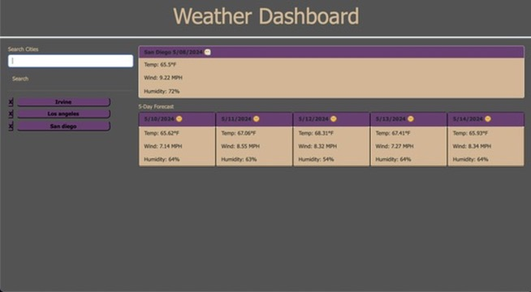

# weather-dashboard

[Deployed Link](https://imneeeks.github.io/weather-dashboard/)

## Description

This is a weather-dashboard application that uses HTML/CSS/JS and pulls data from a server side API.

## Features

- Home page contains input form to search by city

- Search results include current and future conditions for that city

- Conditions show up to five days ahead

- Application is capable of storing previously searched cities for fast access

- City card displays the following information: City name, date, icon representing weather conditions,

- temperature, humidity, and wind speed.

## Credits

Weather data is pulled via OpenWeather API from https://openweathermap.org/

